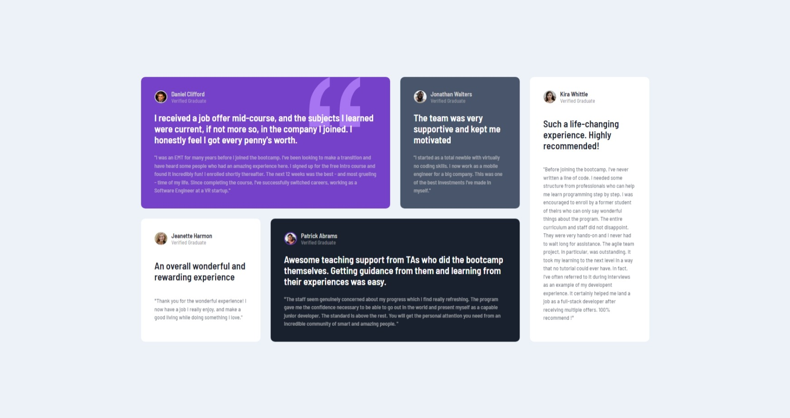
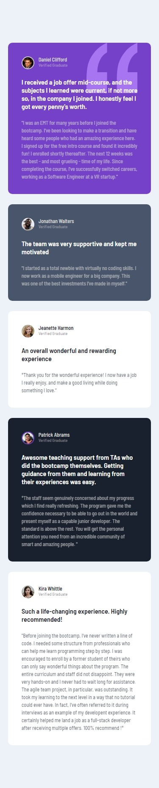

# Frontend Mentor 7th Challenge - Testimonial Grid Section

This is a solution to the [Testimonials grid section challenge on Frontend Mentor](https://www.frontendmentor.io/challenges/testimonials-grid-section-Nnw6J7Un7). Frontend Mentor challenges help you improve your coding skills by building realistic projects. 

## Table of contents

- [Overview](#overview)
  - [Screenshot](#screenshot)
  - [Links](#links)
- [My process](#my-process)
  - [Built with](#built-with)
  - [What I learned](#what-i-learned)
  - [Continued development](#continued-development)
  - [Useful resources](#useful-resources)
- [Author](#author)
- [Acknowledgments](#acknowledgments)

## Overview

### Screenshot

Desktop Screenshot

Mobile Screenshot  

### Links

- Solution URL: [Github](https://github.com/adewalemudasiru/Testimonial-Grid-Section)
- Live Site URL: [SolutionPreview](https://adewalemudasiru.github.io/Testimonial-Grid-Section/)

## My process

### Built with

- Semantic HTML5 markup
- CSS custom properties
- Flexbox
- Grid
- Media queries
- Mobile-first workflow

### What I learned

I got a better understanding of how css grid works and when to choose it over flexbox.

### Continued development

I'll do better in the future. 

## Author

- Website - [Testimonial Page](https://adewalemudasiru.github.io/Testimonial-Grid-Section/)
- Frontend Mentor - [@adewalemudasiru](https://www.frontendmentor.io/profile/adewalemudasiru)
- Twitter - [@ade_mudasiru](https://www.twitter.com/ade_mudasiru)

## Acknowledgments

Myself for a job well done.
 
